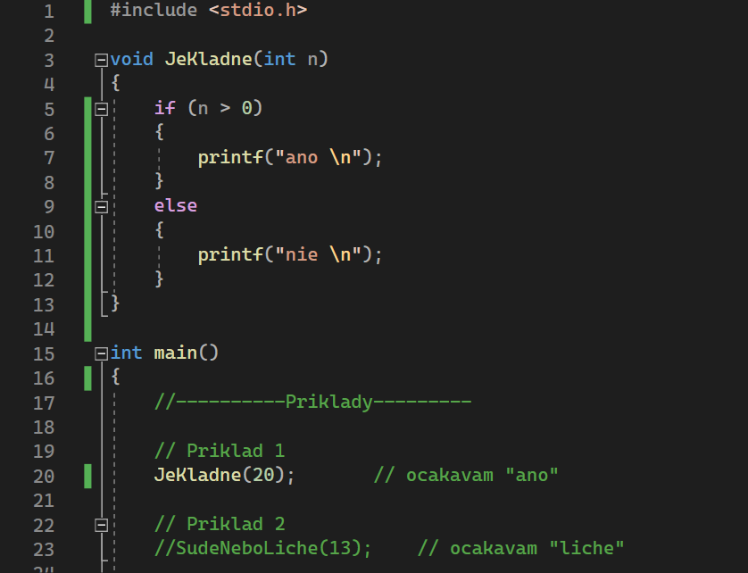

# Cvičenie 3
### Složitosť algoritmov a príklady na pseudokód
viz Cvicenie03 - Slozitost algoritmov.pptx/.pdf

---
### Ako riešiť príklady v C
1. Môžete si vytvoriť nový zdrojový súbor s príponou .c a písať jednotlivé úlohy do main() bloku
   - odporúčam ale nakuknúť do Pseudocode.c alebo Sablona.c aby ste videli ako sa definuje pole
  - 
  - ---
2. Môžete použiť predpripravenú šablónu Sablona.c (Sablona.c je vyčistená od ukážky pseudokódu a obsahuje iba príklady) a písať jednotlivé úlohy ako funkcie
  - ako pridať zdrojový kód do projektu vo Visual Studiu - [Visual Studio Tutorial - C](Tutorials/VisualStudio.md)
  - 

---
### Ako riešiť príklady v Pythone
- Visual Studio Code pre Python - [Visual Studio Code Tutorial - Python](Tutorials/VisualStudioCode.md)
1. Môžete si vytvoriť nový zdrojový súbor s príponou .py a písať jednotlivé úlohy do skriptu pod seba
   - odporúčam ale nakuknúť do Pseudocode.py alebo Sablona.py aby ste videli ako sa definuje pole
  - 
  - ---
2. Môžete použiť predpripravenú šablónu Sablona.py (Sablona.py je vyčistená od ukážky pseudokódu a obsahuje iba príklady) a písať jednotlivé úlohy ako funkcie
  - 

---
### :grey_question: Doporučený úkol
1. Zapíšte algoritmus Znamka(n) pomocou pseudokódu a naprogramujte ho v C/Pythone
   - Pre zadaný počet bodov od 0 do 100, vypíšte známku. Ak je počet bodov 100-90 známka bude "A", 89-80 známka "B", 79-70 známka "C", 69-60 známka "D", 59-50 známka "E", 49-0 známka "F"
   - ---
2. Zapíšte algoritmus PocetLichychASudych(A[0..n-1], n) pomocou pseudokódu a naprogramujte ho v C/Pythone
   - Pre zadané pole A[0..n-1] spočítajte koľko obsahuje lichých a sudých čísel
   - ---
3. Zapíšte algoritmus MinMaxRozdiel(A[0..n-1], n) pomocou pseudokódu a naprogramujte ho v C/Pythone
   - Pre zadané pole A[0..n-1] spočítajte rozdiel medzi jeho maximálnym a minimálnym prvkov

---
### :envelope: Spôsob odovzdávania úkolov
Emailom na adresu katarina.olejkova01@upol.cz s predmetom ALGO1 - Cvicenie03

S prílohami:
- Pre odovzdanie pseudokódov môžete poslať napr. fotku s riešením, texťák atď..
- Pre odovzdanie kódu posielajte iba zdrojové súbory s príponou .c/.py (neodovzdávajte celé projekty) 
