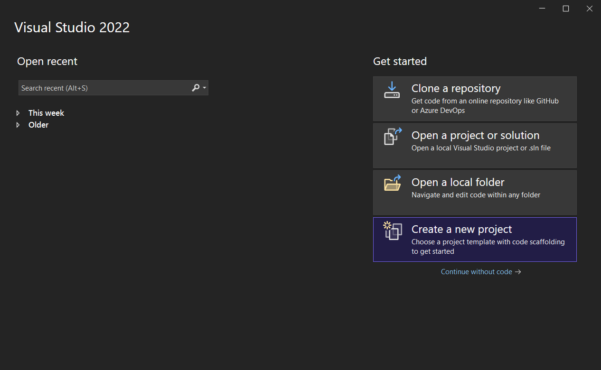
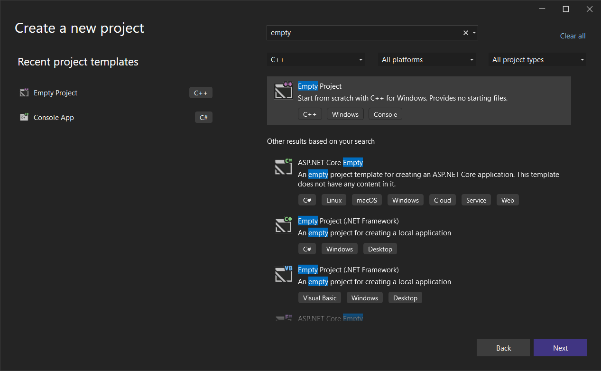
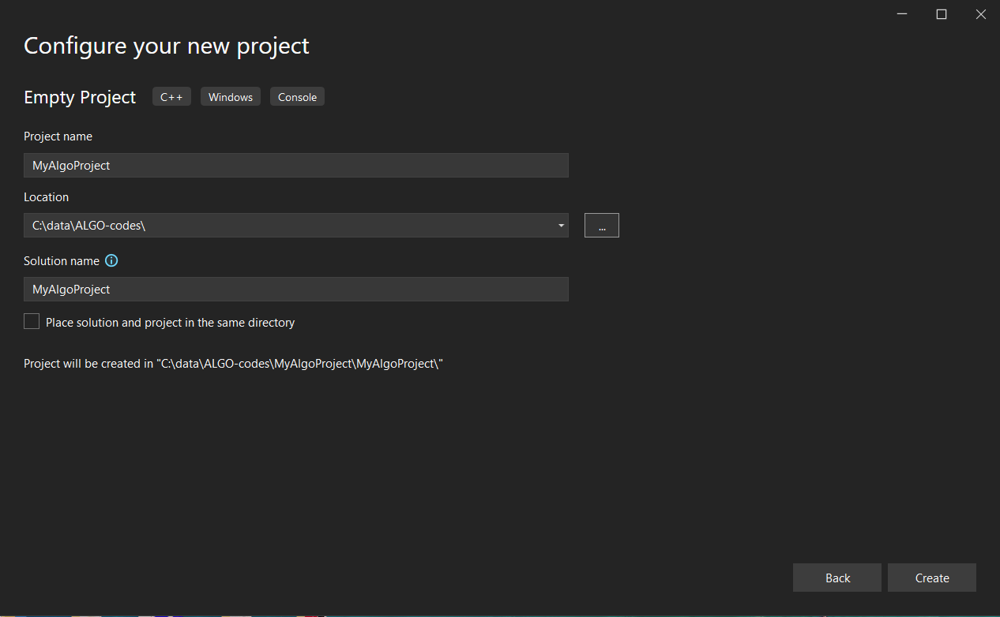
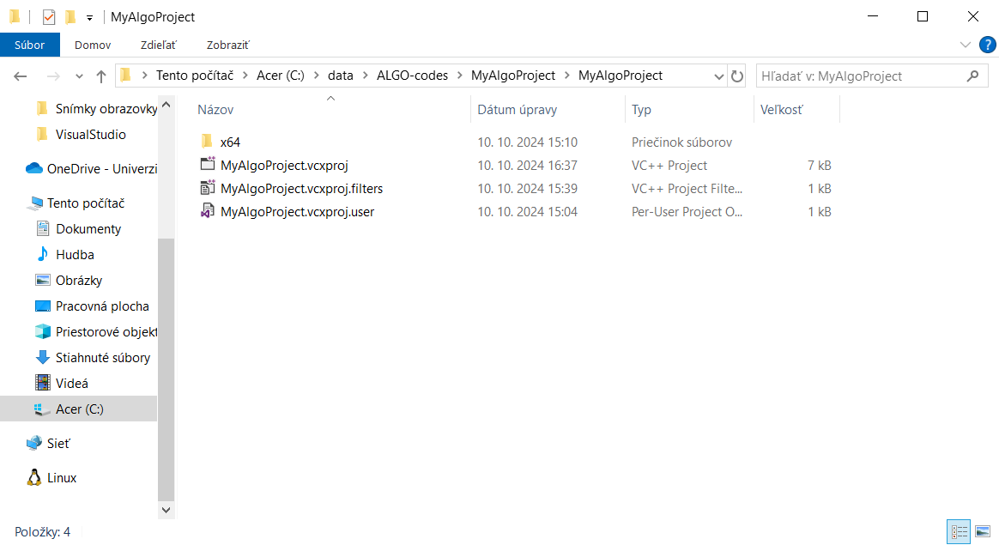
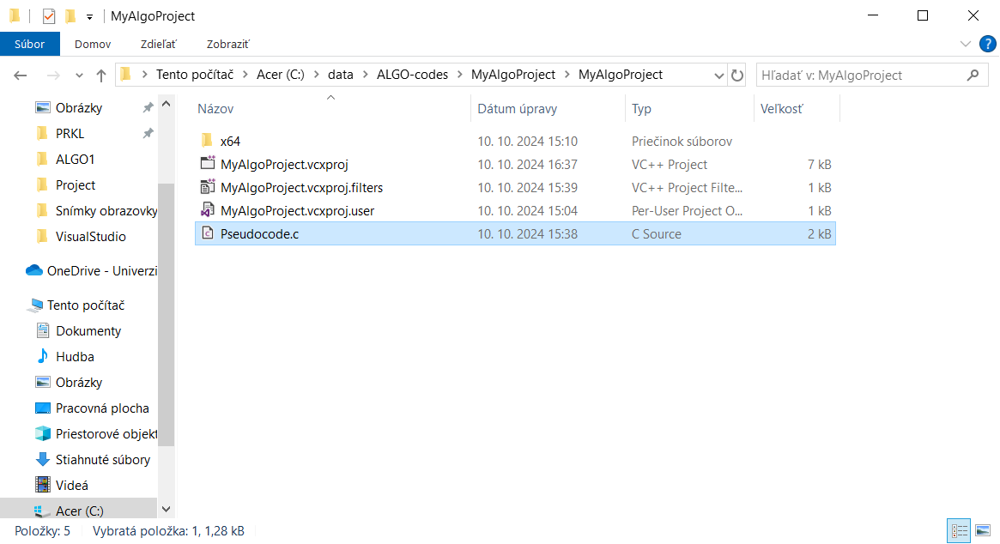
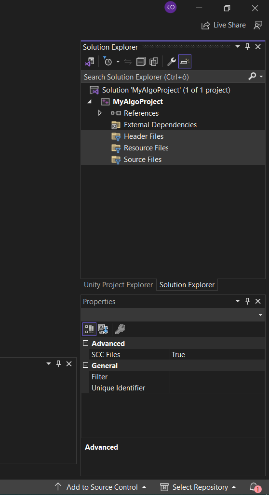
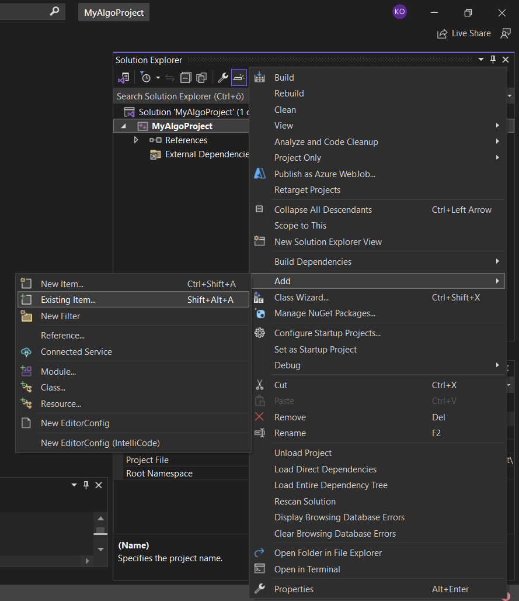
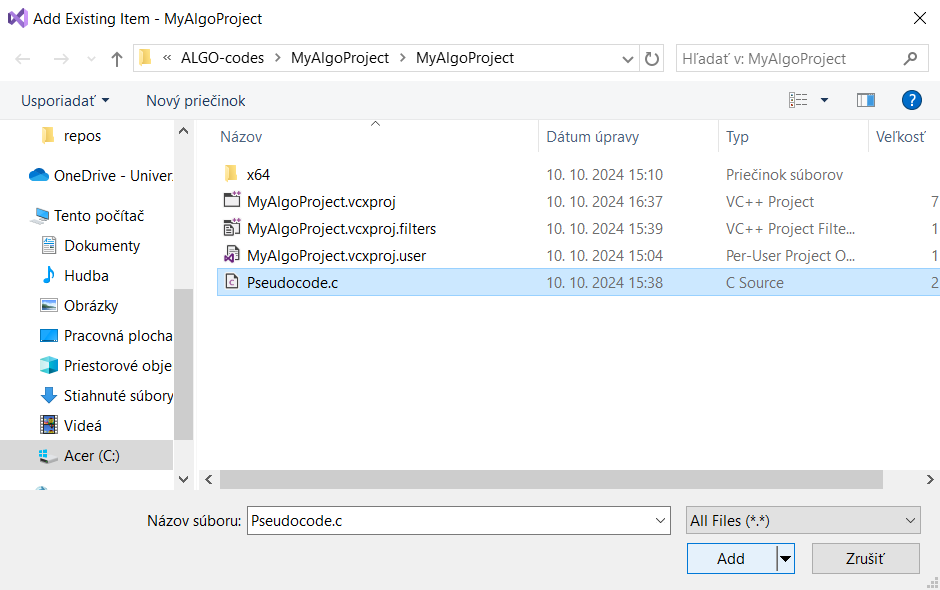
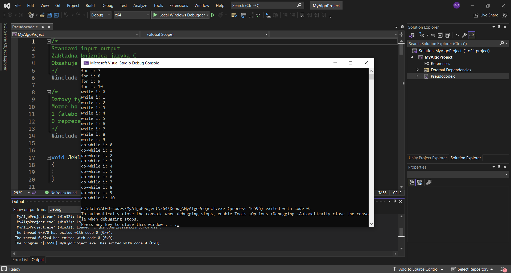

# Visual Studio 2022
### Ako pridať do projektu zdrojový súbor

---
### Vytvorenie nového projektu
- otvorte Visual Studio -> Create a new project
  - 
  - ---
- Vyberte prázdny projekt v C++ (nie konzolovú aplikáciu)
  - 
  - ---
- Zvoľte meno projektu a cestu, kde sa má projekt uložiť
  - 

---
### Pridanie zdrojového súboru
- Po vytvorení nového projektu otvorte zložku s projektom a choďte do podsložky, kde sú uložené .vcxproj súbory
  - 
  - ---
- Tu vložíme požadovaný zdrojový súbor ktorý sme stiahli
  - 
  - ---
- Vo Visual Studiu si otvorte okno Solution Explorer a vymažte nepotrebné filtry Header Files, Resource Files, Source Files
  - 
  - ---
- Kliknite pravým tlačítkom na názov projektu v Solution Explorer (v mojom prípade je to MyAlgoProject, neklikajte na Solution)
- Add -> Existing item
  - 
  - ---
- Vyberieme zdrojový súbor -> Add
  - 
  - ---
- Zdrojový súbor zkompilujeme a spustíme (zelená šípka)
  - 

