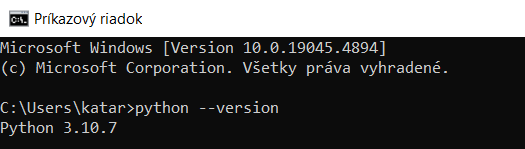
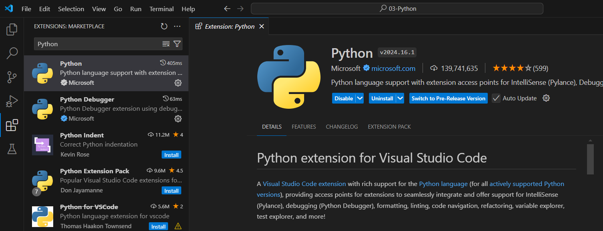

# Visual Studio Code
### VS Code pre prácu v Pythone

---
### Inštalácia Pythonu
- skontrolujte či máte nainštalovaný Python, môžete to zistiť tak že v príkazovom riadku zadáte "python --version" alebo "python3 --version"
  - 
  - ---
- Ak nemáte nainštalovaný Python stiahnite si ho a nainštalujte - (Python.org)[https://www.python.org/]

---
### Konfigurácia VS Code
- Vo VS Code si nainštalujte Extension pre Python
  - 
 
