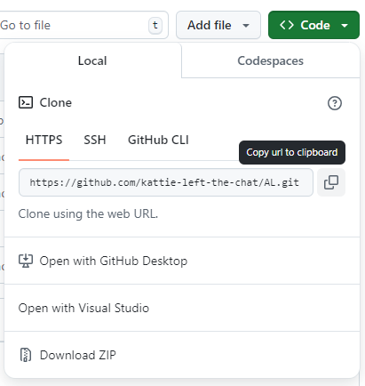
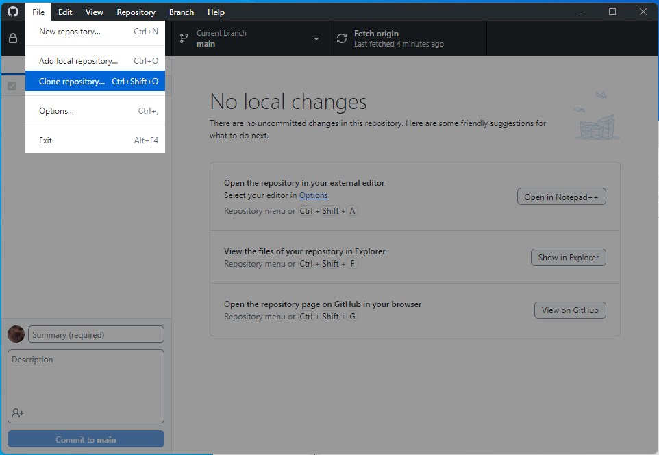
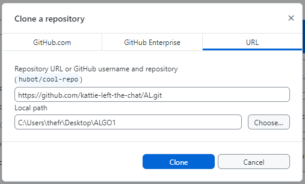
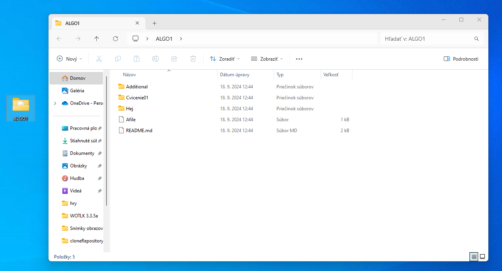
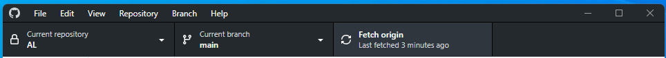
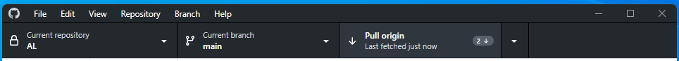

# GitHub Tutorial

---
### Pred prvým cvičením
- Vytvorte si účet na [GitHube](https://github.com/)
- Stiahnite si a nainštalujte [GitHub Desktop](https://github.com/apps/desktop)
- Prihláste sa do GitHub Desktop pomocou svojho GitHub účtu

---
### :arrow_up_down: Naklonovanie remote repozitára predmetu
- GitHub remote repozitár predmetu [ALGO1](https://github.com/kattie-left-the-chat/ALGO1)
  - Code -> Local -> HTTPS -> Copy url
  - 
    - ---
- V GitHub Desktop:
  - File -> Clone repository
    
    - ---
  - Do prvej cesty vložte skopírovanú url adresu repozitára predmetu
  - Druhú cestu zvoľte podľa toho, kde chcete repozitár lokálne naklonovať do vašeho PC
    
    - ---
- Lokálny repozitár
    

---
### :arrow_down: Pull zmien z remote repozitára predmetu
Postupne budem pridávať do tohto repozitára ďalšie cvičenia a materiály.
Pull slúži k tomu aby ste si synchronizovali tieto zmeny do svojho lokálneho repozitára a mali aktuálnu verziu
- V GitHub Desktop:
  - Fetch origin -> Pull origin
    
    
  - Keď máte zmeny synchronizované tak po kliknutí na Fetch origin nedostanete možnosť Pull origin

---
### :bulb: Užitočné odkazy
- [Introduction to GitHub](https://skills.github.com/)
- [Git, GitHub, & GitHub Desktop for beginners](https://www.youtube.com/watch?v=8Dd7KRpKeaE)
